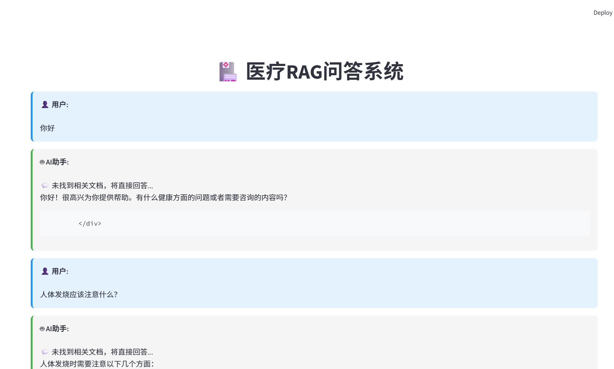

# 🏥 医疗RAG问答系统

> 📸 **项目演示截图**
> 
> 
> 
> *请将项目截图放在 `images/` 目录下*

基于 LangChain、Ollama 和 PostgreSQL 的智能医疗文档检索增强生成系统，支持 RAG 检索问答和智能聊天双模式。

## ✨ 核心功能

- 📚 **文档管理**：支持 PDF、Word、TXT 格式的医疗文档导入
- 📤 **文件上传**：支持单文件和批量文件上传，自动导入知识库
- 🔍 **智能检索**：基于语义的向量相似度搜索
- 🔄 **MD5 去重**：自动检测重复文档，避免重复导入
- 💬 **双模式问答**：
  - RAG 模式：基于检索到的文档生成专业回答
  - 聊天模式：无相关文档时直接调用 LLM 智能对话
- 🔄 **多轮对话**：保留对话历史，支持上下文理解
- 📊 **对话管理**：自动保存对话记录到数据库
- 🔄 **知识库更新**：支持增量更新和全量更新
- 📈 **进度显示**：文件上传和导入过程实时进度反馈
- 🌐 **双界面支持**：
  - FastAPI RESTful API（支持交互式文档）
  - Streamlit Web 前端界面

## 🏗️ 技术架构

### 技术栈

| 组件 | 技术 | 版本 |
|------|------|------|
| **后端框架** | FastAPI | latest |
| **RAG框架** | LangChain | latest |
| **LLM** | Ollama (qwen2.5:7b) | latest |
| **嵌入模型** | Ollama (bge-m3) | latest |
| **向量数据库** | PostgreSQL + pgvector | latest |
| **前端界面** | Streamlit | latest |
| **Python版本** | Python | 3.11+ |

### 项目结构

```
Medical_rag/
├── api/                    # API路由模块
│   ├── __init__.py
│   ├── routes.py          # FastAPI路由定义
│   └── schemas.py         # Pydantic数据模型
├── database/              # 数据库模块
│   ├── __init__.py
│   ├── connection.py      # 数据库连接管理
│   └── models.py          # SQLAlchemy数据模型
├── rag/                   # RAG核心模块
│   ├── __init__.py
│   ├── document_loader.py # 文档加载器（PDF/Word/TXT）
│   ├── text_splitter.py   # 智能文本分割器
│   ├── vector_store.py    # 向量存储管理
│   ├── retriever.py       # 文档检索器
│   ├── rag_chain.py       # RAG链核心逻辑
│   ├── md5_checker.py     # MD5去重校验器
│   ├── file_upload_service.py  # 文件上传服务
│   └── knowledge_base_update.py # 知识库更新服务
├── llm/                   # LLM客户端模块
│   ├── __init__.py
│   └── ollama_client.py   # Ollama API客户端
├── data/                  # 数据目录
│   ├── medical_docs/      # 医疗文档存储
│   └── md5_records.txt    # MD5去重记录
├── logs/                  # 日志目录
├── config.py              # 项目配置
├── main.py                # FastAPI应用入口
├── app_streamlit.py       # Streamlit前端应用
├── requirements.txt       # Python依赖
└── setup.py              # 初始化脚本
```

## 🚀 快速开始

### 前置要求

1. **Python 3.11+**
2. **Ollama** - 本地大模型服务
3. **PostgreSQL** - 关系型数据库（需安装 pgvector 扩展）

### 步骤1：安装 Ollama 和模型

```bash
# 下载安装 Ollama
# Windows: https://ollama.com/download/windows

# 拉取所需模型
ollama pull qwen2.5:7b      # 对话模型
ollama pull bge-m3:latest   # 嵌入模型

# 查看已安装模型
ollama list
```

### 步骤2：安装 PostgreSQL 和 pgvector

```sql
-- 创建数据库
CREATE DATABASE medical_rag_db;

-- 启用 pgvector 扩展
CREATE EXTENSION IF NOT EXISTS vector;
```

### 步骤3：克隆项目并安装依赖

```bash
# 克隆项目
cd Medical_rag

# 创建虚拟环境（推荐）
python -m venv .venv
.venv\Scripts\activate  # Windows
# source .venv/bin/activate  # Linux/Mac

# 安装依赖
pip install -r requirements.txt
```

### 步骤4：配置环境变量

```bash
# 复制配置模板
copy .env.example .env  # Windows
# cp .env.example .env  # Linux/Mac

# 编辑 .env 文件，修改以下配置：
# - DATABASE_URL：数据库连接字符串
# - OLLAMA_BASE_URL：Ollama服务地址（默认 http://localhost:11434）
# - EMBEDDING_MODEL：嵌入模型名称
# - LLM_MODEL：对话模型名称
```

### 步骤5：启动服务

#### 启动后端服务

```bash
python main.py
```

访问 API 文档：http://localhost:8000/docs

#### 启动前端界面（新终端）

```bash
streamlit run app_streamlit.py
```

访问前端界面：http://localhost:8501

### 步骤6：导入文档

#### 方式一：通过前端界面上传文件

1. 在侧边栏选择文档分类
2. 上传单个文件或批量上传多个文件
3. 系统自动检测重复文件（MD5 去重）
4. 自动导入到知识库

#### 方式二：通过 API 导入目录文档

```bash
curl -X POST "http://localhost:8000/api/v1/ingest" \
  -H "Content-Type: application/json" \
  -d '{
    "data_dir": "data/medical_docs",
    "category": "general"
  }'
```

#### 方式三：知识库更新

- **增量更新**：仅导入新增文件，自动跳过已存在文档
  ```bash
  curl -X POST "http://localhost:8000/api/v1/update/incremental"
  ```

- **全量更新**：重新导入所有文件
  ```bash
  curl -X POST "http://localhost:8000/api/v1/update/full"
  ```

## 📖 API 文档

### 主要接口

| 接口 | 方法 | 说明 |
|------|------|------|
| `/api/v1/health` | GET | 健康检查 |
| `/api/v1/query` | POST | 智能问答 |
| `/api/v1/query-stream` | POST | 流式问答 |
| `/api/v1/ingest` | POST | 导入目录文档 |
| `/api/v1/stats` | GET | 获取统计信息 |
| `/api/v1/documents/delete` | POST | 删除文档 |
| `/api/v1/upload` | POST | 上传单个文件 |
| `/api/v1/upload/batch` | POST | 批量上传文件 |
| `/api/v1/ingest-file` | POST | 导入已上传文件 |
| `/api/v1/files` | GET | 获取文件列表 |
| `/api/v1/files/{filename}` | DELETE | 删除文件 |
| `/api/v1/update/incremental` | POST | 增量更新知识库 |
| `/api/v1/update/full` | POST | 全量更新知识库 |

### 文件上传接口示例

#### 单文件上传

```bash
curl -X POST "http://localhost:8000/api/v1/upload" \
  -F "file=@document.pdf" \
  -F "category=general"
```

#### 批量文件上传

```bash
curl -X POST "http://localhost:8000/api/v1/upload/batch" \
  -F "files=@doc1.pdf" \
  -F "files=@doc2.docx" \
  -F "category=general"
```

### 问答接口示例

```bash
curl -X POST "http://localhost:8000/api/v1/query" \
  -H "Content-Type: application/json" \
  -d '{
    "question": "感冒了应该吃什么药？",
    "session_id": "session_001",
    "k": 5,
    "category": "general"
  }'
```

响应示例：

```json
{
  "question": "感冒了应该吃什么药？",
  "answer": "根据医学指南，感冒治疗以对症治疗为主...",
  "context_count": 5,
  "sources": [
    {
      "content": "常用药物包括解热镇痛药...",
      "source": "感冒诊疗指南.txt",
      "category": "general"
    }
  ]
}
```

## ⚙️ 配置说明

### 环境变量

| 变量名 | 默认值 | 说明 |
|--------|--------|------|
| `DATABASE_URL` | - | PostgreSQL连接字符串 |
| `OLLAMA_BASE_URL` | `http://localhost:11434` | Ollama服务地址 |
| `EMBEDDING_MODEL` | `bge-m3:latest` | 嵌入模型名称 |
| `LLM_MODEL` | `qwen2.5:7b` | 对话模型名称 |
| `CHUNK_SIZE` | `500` | 文本块大小 |
| `CHUNK_OVERLAP` | `50` | 文本块重叠 |
| `TOP_K` | `5` | 检索返回数量 |
| `API_HOST` | `0.0.0.0` | API服务地址 |
| `API_PORT` | `8000` | API服务端口 |
| `DEBUG` | `true` | 调试模式 |
| `LOG_LEVEL` | `INFO` | 日志级别 |
| `MAX_UPLOAD_SIZE` | `52428800` | 最大上传文件大小（50MB） |
| `ALLOWED_EXTENSIONS` | `pdf,docx,txt` | 允许上传的文件格式 |

## 🎯 工作流程

### RAG 问答流程

```
用户提问
  ↓
语义检索（bge-m3）
  ↓
找到相关文档？
  ├─ 是 → RAG模式：基于文档生成回答
  └─ 否 → 聊天模式：直接调用LLM对话
  ↓
返回回答 + 参考来源
  ↓
保存到数据库
```

### 文件上传与导入流程

```
用户上传文件
  ↓
文件验证（格式、大小）
  ↓
保存到本地目录
  ↓
MD5 校验（检查是否重复）
  ├─ 已存在 → 跳过
  └─ 新文件 → 继续
  ↓
文档加载（PDF/Word/TXT）
  ↓
文本分割
  ↓
生成向量嵌入
  ↓
存储到向量数据库
  ↓
更新 MD5 记录
```

### 智能切换逻辑

1. **有相关文档**：使用 RAG 模式，确保回答的准确性和可溯源性
2. **无相关文档**：使用聊天模式，提供智能对话体验
3. **对话历史**：保留最近 3 轮对话上下文

## 🛠️ 开发指南

### 代码规范

- 遵循 PEP 8 编码规范
- 使用类型注解（Type Hints）
- 添加详细的文档字符串（Docstrings）
- 使用 Loguru 进行日志记录

### 扩展功能

#### 添加新的文档格式

在 `rag/document_loader.py` 中添加对应的加载器：

```python
def load_new_format(self, file_path: str) -> List[Document]:
    """加载新格式文档"""
    # 实现加载逻辑
    pass
```

#### 自定义系统提示词

在 `rag/rag_chain.py` 的 `_chat_mode` 方法中修改 `system_prompt`。

#### 调整检索参数

在 `.env` 文件中修改：

```env
CHUNK_SIZE=500        # 文档块大小
CHUNK_OVERLAP=50      # 重叠大小
TOP_K=5               # 检索数量
```

## 🐛 常见问题

### 1. Ollama 连接失败

**问题**：`Connection refused` 或模型未找到

**解决**：
- 确认 Ollama 服务已启动：`ollama serve`
- 检查模型是否已下载：`ollama list`
- 验证服务地址是否正确

### 2. 数据库连接失败

**问题**：`could not connect to server`

**解决**：
- 确认 PostgreSQL 服务已启动
- 检查 `.env` 中的数据库配置
- 确认 pgvector 扩展已安装

### 3. 回答质量不佳

**优化建议**：
- 增加相关文档数量和质量
- 调整 `TOP_K` 参数（增大或减小）
- 优化文档内容和结构
- 尝试不同的嵌入模型或 LLM 模型

### 4. Streamlit 警告信息

**问题**：`Thread 'MainThread': missing ScriptRunContext`

**解决**：这些警告不影响功能，仅在非 Streamlit 环境下运行时出现。确保使用 `streamlit run app_streamlit.py` 启动前端。

### 5. 文件上传失败

**问题**：`Form data requires "python-multipart" to be installed`

**解决**：
```bash
pip install python-multipart
```

### 6. Streamlit 命令未找到

**问题**：`streamlit : 无法将"streamlit"项识别为 cmdlet`

**解决**：
```bash
# 方式一：使用 Python 模块运行
python -m streamlit run app_streamlit.py

# 方式二：确保虚拟环境激活并安装 streamlit
.venv\Scripts\activate
pip install streamlit
```

## 📊 系统架构

```
┌─────────────────────────────────────────────────┐
│                  Streamlit 前端                  │
│              http://localhost:8501               │
│  ┌──────────┐  ┌──────────  ┌──────────────  │
│  │ 文件上传 │  │ 进度显示 │  │ 知识库更新   │  │
│  └────┬─────┘  └────┬─────  └──────┬───────┘  │
└───────┼─────────────┼──────────────────────────┘
        │ HTTP REST API
┌───────▼─────────────▼────────────────▼──────────┐
│               FastAPI 后端服务                    │
│              http://localhost:8000               │
│  ┌──────────┐  ┌──────────  ┌──────────────  │
│  │  RAG链   │  │ MD5去重  │  │ 文件上传服务 │  │
│  └────┬─────┘  └────┬─────  └─────────────┘  │
└───────┼─────────────┼──────────────────────────┘
        │             │                │
┌───────▼─────┐ ┌────▼──────┐  ┌──────▼──────────┐
│ PostgreSQL  │ │ Ollama    │  │  Ollama         │
│ + pgvector  │ │ bge-m3    │  │  qwen2.5:7b     │
│ 向量存储    │ │ 嵌入模型  │  │  对话模型       │
└─────────────┘ └───────────┘  └─────────────────┘
```

## 📝 许可证

本项目仅供学习和研究使用。

## 🤝 贡献

欢迎提交 Issue 和 Pull Request！

## 📧 联系方式

如有问题，请提交 GitHub Issue。

---

**⚠️ 免责声明**：本系统仅供参考，不能替代专业医疗建议。如有健康问题，请咨询专业医生。
